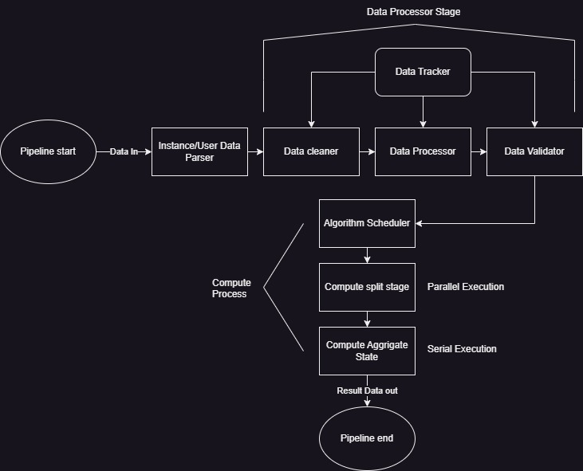

# Pipelines

- Every data the worker receives is processed and converted into a pipeline.
- These pipelines are scheduled on available threads.
- The pipelines componets are serially processed and the individual componenets can be scheduled parellely.
- The End result is sent out as is to the server therefore the pipeline must give out finished result in appropriate format
- We will use the below flowchart to understand the pipeline processes.

### Initial/Receiver Processing stage

- In this stage the packet is received by the worker from server. The worker validates the packet and extracts the data from packet.
- The data extracted is segrigated as  User data or Instance data depending on packet Type(Packet header).
- This data if it is user data is converted into data structure and passed to the next stage(Data Processor stage), Else the instance list is updated with the new instance data.
- The Data Processor stage is scheduled for user data.

### Data Processor Stage

- The data structure is received from previous stage is initilized into a new data structure.
- The data processor stage runs both serially and parellely.
- The Data Processor entry program only initilizes the data processor and in `finalize` it schedules the data clean phase(serial).
- The data clean phase cleans the duplicate records/data from the received user data.
- Once the clean phase is done the data is validated(parellel) and checked for errors. If found the data is handled according to data instance rules.
- The validation is run parelly and updates data tracker once done.
- The data processor stage hands the processed data to 'algorihtm scheduler' further actions.
- The 'Cleaned Data(Processed Data)' is sent out to the server via the sender module.

### Algorithm Scheduler

- This is a minor stage that schedules the processed data on to the scheduler.
- It picks the correct instance rules and data compute algorithm, These information are present in the packet which is extacted during receiver stage.

### Compute Stage

- The compute algorithm schedules the user data compute in a two stage process.
- The first stage being 'Split Stage' which processes the data parellely and updates the result to the data tracker.
- The second stage being 'Aggrigate Stage' which is a single serial process. It can only be executed after all scheduled processes of first stage are complete.
- The Aggrigate Stage takes results from previous stage and combines the result according to the algorithm rules.
- The Aggrigate generates the final result.

### Pipeline data out

- Once all stages above are complete the aggriagted result is collected and the final resultant data is sent out the server via sender module.
- The packet is created with appropriate flags in the header and scheduled in the sender queue for dispatch.
